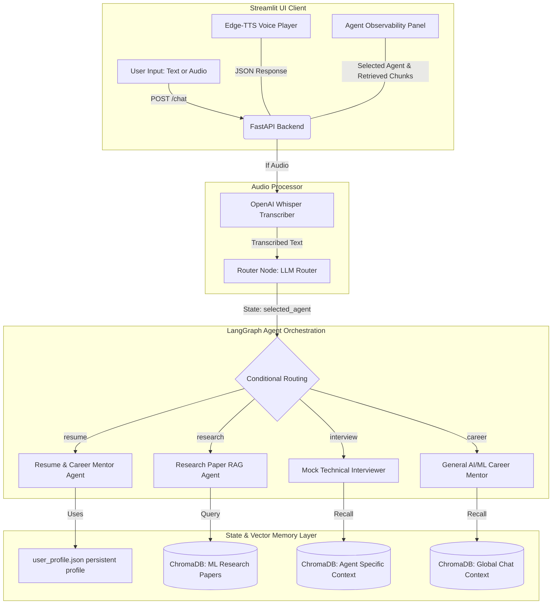

# AgentForge-AI

**AgentForge-AI** is a premium, high-performance mock interview preparation suite and technical research copilot tailored specifically for **Machine Learning and Artificial Intelligence job candidates**. 

Built with a **FastAPI backend** and a **Streamlit frontend**, the application leverages **LangChain**, **LangGraph**, and **ChromaDB** to orchestrate specialized agent personas. Candidates can upload their resume to dynamically generate an interactive profile, upload state-of-the-art ML research papers to query complex methodologies, and participate in realistic vocal mock technical interviews powered by speech-to-text (**OpenAI Whisper**) and text-to-speech (**Edge-TTS**).

---

## 🧠 Architecture Overview

AgentForge-AI operates on an asynchronous event-driven layout, utilizing a modular LangGraph routing engine to coordinate specialized agent execution.



---

## 🛠️ Specialized Agents & Workflow

The orchestration pipeline separates routing logic from execution nodes using a clean **LangGraph Conditional Edges** design:

1. **Router Node (`router`)**: Leverages Google Gemini to inspect the user's intent and direct the state to one of four specialized execution nodes in the graph.
2. **Resume Agent Node (`resume`)**: Performs automated ATS resume analysis. It dynamically critiques the candidate's experiences, identifies keyword gaps, and suggests tailored study roadmaps.
3. **Research Agent Node (`research`)**: Implements a Vector RAG pipeline. It ingests complex research PDFs, extracts textual segments, computes embeddings locally, and queries them to explain methodologies or formulas.
4. **Interview Agent Node (`interview`)**: Simulates a live technical interviewer. It conducts voice-supported ML mock interviews, posing coding or systems design questions one at a time and evaluating responses.
5. **Career Agent Node (`career`)**: Serves as a general career mentor, advising on skill development, projects, and interview strategies.

---

## ⚙️ Technical Deep-Dive

To make the codebase interview-ready and reliable, several advanced backend engineering patterns have been implemented:

### 1. Deterministic Cryptographic Database IDs
* **The Problem:** Standard python process `hash()` keys are non-deterministic and randomize on every server restart. In older revisions, this caused massive memory duplication in ChromaDB.
* **The Solution:** Swapped to cryptographic MD5 hashing (`hashlib.md5(text.encode('utf-8')).hexdigest()`) to produce stable, unique document IDs that survive server reboots and support precise memory lookups.

### 2. Smart User Profile Ingestion
* **The Problem:** Career interest configurations were hardcoded to generic defaults.
* **The Solution:** Integrated an LLM extraction routine. When a resume PDF is uploaded, Gemini parses the text, extracts key tech skills and the candidate's actual specific career path (e.g., *NLP Specialist*, *MLOps Engineer*), and persists it directly into `user_profile.json` as context for subsequent mock interview sessions.

### 3. Non-Blocking Event Loop (Async Thread Offloading)
* **The Problem:** CPU-heavy local Whisper transcriptions, PDF parsing, SentenceTransformers local encodings, and network-bound LLM graph calls blocked FastAPI's single event loop, causing server freezes.
* **The Solution:** Offloaded all synchronous CPU and network dependencies to an asynchronous worker thread pool using `asyncio.to_thread(...)`. The server remains highly responsive even when multiple users are uploading PDFs or transcribing speech.

---

## 📂 Project Structure

```text
AgentForge-AI/
│
├── backend/                  # FastAPI Backend Server
│   ├── .env                  # API keys and local configuration
│   ├── main.py               # FastAPI server entry point & async API endpoints
│   ├── workflow.py           # LangGraph conditional graph declaration
│   ├── agent.py              # LLM client configuration
│   ├── tools.py              # External agent tool bindings
│   ├── research_agent.py     # Local SentenceTransformer + PDF parsing pipeline
│   ├── memory.py             # Chat history structure
│   ├── profile_memory.py     # Persistent candidate profile management
│   ├── vector_memory.py      # ChromaDB global conversation memory
│   ├── agent_memory.py       # ChromaDB agent-specific memory
│   │
│   ├── agents/               # Specialized Graph Agent Personas
│   │   ├── router_agent.py   # State classifier LLM
│   │   ├── resume_agent.py   # Resume critiquing & ATS analysis
│   │   ├── research_agent_node.py # Context-aware RAG synthesizer
│   │   ├── career_agent.py   # AI/ML mentorship advisor
│   │   └── interview_agent.py# Concise speech-enabled interviewer
│   │
│   ├── chroma_db/            # Local vector database for chat memory
│   ├── research_db/          # Local vector database for paper RAG
│   └── agent_memory_db/      # Local vector database for agent memories
│
├── frontend/                 # Streamlit Frontend Client
│   └── app.py                # Chat interface & audio recording client
│
├── requirements.txt          # Python dependencies
└── README.md                 # Project documentation
```

---

## 🚀 Setup Instructions

### 1. Prerequisites
Ensure you have **Python 3.10+** installed on your system. You will need API keys for:
* Google Gemini (`GOOGLE_API_KEY`)
* Tavily Search (`TAVILY_API_KEY`)

### 2. Installation
```bash
# Clone the repository
git clone https://github.com/Abhiprameesh/AgentForge-AI.git
cd AgentForge-AI

# Create and activate a virtual environment
python -m venv .venv
# On Windows:
.venv\Scripts\activate
# On Mac/Linux:
source .venv/bin/activate

# Install required dependencies
pip install -r requirements.txt
```

### 3. Environment Variables
Create a `.env` file in the `backend/` directory:
```env
GOOGLE_API_KEY=your_gemini_api_key
TAVILY_API_KEY=your_tavily_api_key
```

### 4. Running the Application

Open two separate terminals and activate the virtual environment in both.

**Terminal 1: Start the FastAPI Backend**
```bash
cd backend
uvicorn main:app --reload
```

**Terminal 2: Start the Streamlit Frontend**
```bash
cd frontend
streamlit run app.py
```

---

## 💡 Usage Guide
1. **Define Your Profile:** In the sidebar, select **Resume** and upload a PDF. AgentForge-AI automatically parses your technical experiences, saves your profile, and routes you to the Resume Agent for detailed feedback.
2. **Research Ingestion:** Select **Research Paper** and upload a deep learning paper. Ask questions like *"Explain how equation 3 in the paper works"* to retrieve semantic context from the ChromaDB vector database.
3. **Mock Interview Preparation:** Ask the AI *"Let's start a mock interview for a Machine Learning Engineer role"*. Speak your answers aloud via the recording button in the Streamlit UI, and listen to the interviewer's real-time spoken evaluation and follow-up questions.
