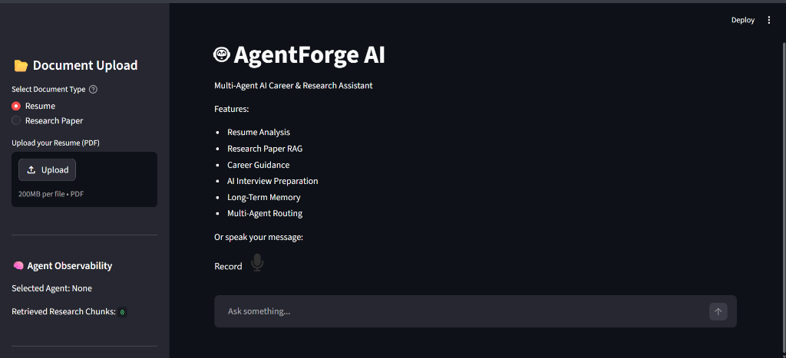
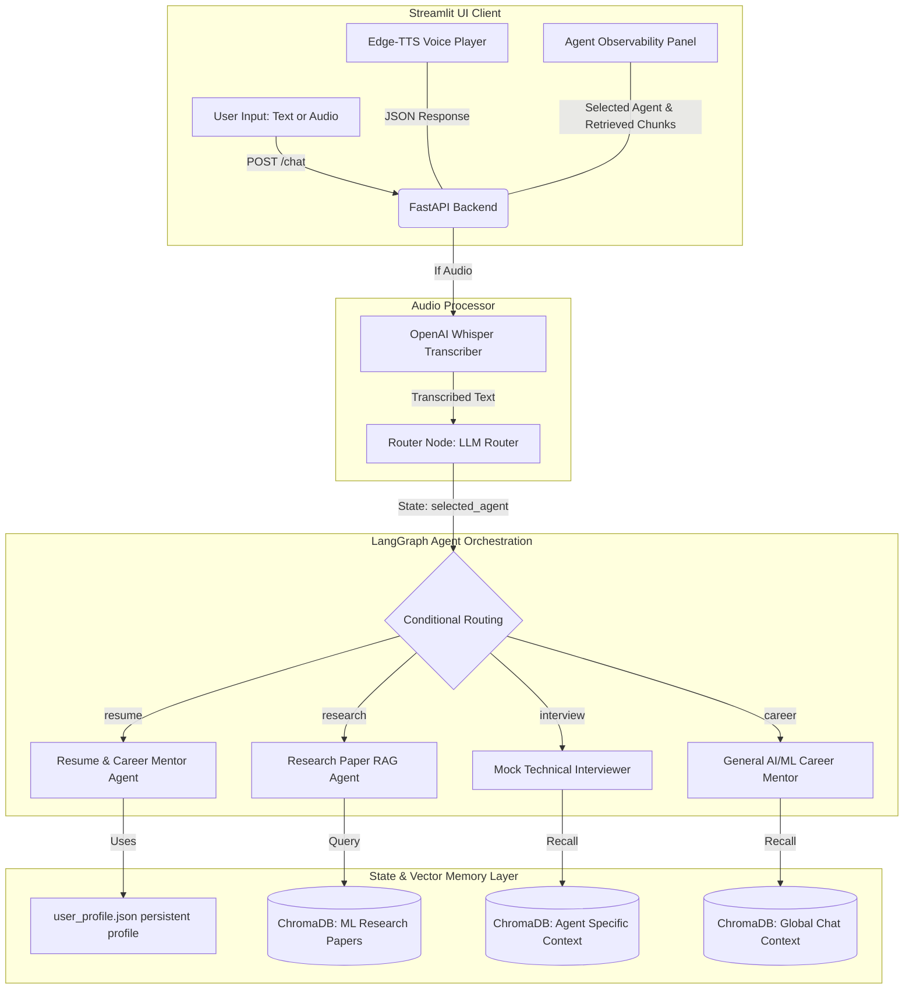

# AgentForge-AI

Welcome to **AgentForge-AI**, an intelligent application designed to help users analyze resumes, search for career opportunities, and explore AI research contexts using state-of-the-art Generative AI technologies.

This project is divided into a **FastAPI backend** and a **Streamlit frontend**, utilizing **LangChain**, **LangGraph**, and **ChromaDB** to orchestrate an Agentic AI workflow with vector-based memory capabilities.

<div align="center">


**A Premium, Voice-Enabled Multi-Agent Interview Preparation Suite and Technical Research Copilot for AI & Machine Learning Candidates.**

<br/>



</div>

---

## 🎯 Why This Project Matters

Most AI interview platforms rely on static question banks or simple chatbot wrappers. **AgentForge-AI** introduces a fully modular, multi-agent orchestration architecture capable of semantic memory retrieval, real-time vocal interaction, research-aware RAG pipelines, and personalized mock interview orchestration. 

It is designed specifically for **AI/ML candidates** who need to mock-interview on complex technical concepts and state-of-the-art research papers, bridging the gap between raw resume details and practical engineering depth.

---

## ✨ Key Features

*   **Multi-Agent Graph Orchestration:** Specialized agents coordinate dynamically using LangGraph.
*   **Vocal Mock Technical Interviews:** Immersive voice-to-voice interview loops using speech-to-text (**OpenAI Whisper**) and text-to-speech (**Edge-TTS**).
*   **Vector-Based Research Paper RAG:** Deep semantic retrieval over complex research PDFs to ask technical questions and critique methodologies.
*   **Automated Resume ATS Analysis:** Immediate parsing and keyword critique mapping candidate backgrounds directly to target AI job roles.
*   **Stateful Memory Systems:** Dual-layer memory utilizing persistent vector memories (**ChromaDB**) and persistent user profiles.

---

## 🛠️ Tech Stack & Technologies Used

AgentForge-AI leverages a modern, async-first AI engineering stack:

### 🖥️ Frontend Client
*   **Streamlit:** Web interface with low-friction, responsive interactive components.
*   **Edge-TTS:** Real-time spoken dialogue generation via text-to-speech synthesis.

### ⚙️ Backend Web API
*   **FastAPI:** Asynchronous, high-performance web routing framework.
*   **Uvicorn:** ASGI server for executing the FastAPI application.

### 🧠 Agentic Orchestration & AI
*   **LangGraph:** Stateful agent orchestration framework for multi-agent loops.
*   **Google Gemini (via Gen AI SDK):** Primary reasoning and agent router LLM.
*   **Sentence-Transformers (`all-MiniLM-L6-v2`):** Local model generating dense vector embeddings.
*   **OpenAI Whisper:** Speech-to-text transcription engine.
*   **Tavily Search API:** Live search results for candidate career matchmaking.

### 💾 Data & Memory Layer
*   **ChromaDB:** Local vector database for indexing and querying semantic memories and PDF text chunks.
*   **PyPDF:** Resume and research document parsing and raw text extraction.

---

## 📊 Engineering & Performance Highlights

*   **Non-Blocking Async Backend:** Synced CPU-heavy Whisper transcriptions and PDF vector encodings are offloaded to an asynchronous worker thread pool using `asyncio.to_thread`. FastAPI’s main event loop remains unblocked.
*   **Deterministic Cryptographic Memory IDs:** Swapped Python's non-deterministic built-in `hash()` for stable MD5 hashing (`hashlib.md5`). This prevents memory duplication and database bloat in ChromaDB across server reboots.
*   **Optimized Graph Latency:** Removed redundant planning steps to run a clean conditional-routing architecture. Cut API response latency in half, saving **1.5 - 2.0 seconds** of redundant LLM processing per turn.
*   **Smart Profile Ingestion:** Ingested resumes are analyzed dynamically via LLM extraction to populate the candidate's actual skills and career focus, replacing old hardcoded defaults.

---

## 🧩 Core AI Engineering Concepts Demonstrated

*   **Multi-Agent Orchestration & Delegation:** Graph state routing based on intent classification.
*   **Retrieval-Augmented Generation (RAG):** Context injection using local SentenceTransformer embeddings and persistent ChromaDB indexing.
*   **Dual-Layer Memory Systems:** Coexistence of global chat-level vector stores, agent-specific localized contexts, and serialized JSON profiles.
*   **Speech-to-Text & Text-to-Speech Pipelines:** Processing raw voice messages to text and synthesizing human-like audio streams.
*   **Concurrent Thread Offloading:** Designing high-throughput web app backends by isolating computational AI bottlenecks from async networking.

---

## 🧠 System Architecture

The application coordinates frontend inputs, audio processing, routing nodes, and vector memories in a unified pipeline:



---

## 📂 Project Structure

```text
AgentForge-AI/
│
├── backend/                  # FastAPI Backend Server
│   ├── .env                  # API keys and local configuration
│   ├── main.py               # FastAPI server entry point & async API endpoints
│   ├── workflow.py           # LangGraph conditional graph declaration
│   ├── agent.py              # LLM client configuration
│   ├── tools.py              # External agent tool bindings
│   ├── research_agent.py     # Local SentenceTransformer + PDF parsing pipeline
│   ├── memory.py             # Chat history structure
│   ├── profile_memory.py     # Persistent candidate profile management
│   ├── vector_memory.py      # ChromaDB global conversation memory
│   ├── agent_memory.py       # ChromaDB agent-specific memory
│   │
│   ├── agents/               # Specialized Graph Agent Personas
│   │   ├── router_agent.py   # State classifier LLM
│   │   ├── resume_agent.py   # Resume critiquing & ATS analysis
│   │   ├── research_agent_node.py # Context-aware RAG synthesizer
│   │   ├── career_agent.py   # AI/ML mentorship advisor
│   │   └── interview_agent.py# Concise speech-enabled interviewer
│   │
│   ├── chroma_db/            # Local vector database for chat memory
│   ├── research_db/          # Local vector database for paper RAG
│   └── agent_memory_db/      # Local vector database for agent memories
│
├── frontend/                 # Streamlit Frontend Client
│   └── app.py                # Chat interface & audio recording client
│
├── requirements.txt          # Python dependencies
└── README.md                 # Project documentation
```

---

## 🚀 Setup Instructions

### 1. Prerequisites
Ensure you have **Python 3.10+** installed on your system. You will need API keys for:
* Google Gemini (`GOOGLE_API_KEY`)
* Tavily Search (`TAVILY_API_KEY`)

### 2. Installation
```bash
# Clone the repository
git clone https://github.com/Abhiprameesh/AgentForge-AI.git
cd AgentForge-AI

# Create and activate a virtual environment
python -m venv .venv
# On Windows:
.venv\Scripts\activate
# On Mac/Linux:
source .venv/bin/activate

# Install required dependencies
pip install -r requirements.txt
```

### 3. Environment Variables
Create a `.env` file in the `backend/` directory:
```env
GOOGLE_API_KEY=your_gemini_api_key
TAVILY_API_KEY=your_tavily_api_key
```

### 4. Running the Application

Open two separate terminals and activate the virtual environment in both.

**Terminal 1: Start the FastAPI Backend**
```bash
cd backend
uvicorn main:app --reload
```

**Terminal 2: Start the Streamlit Frontend**
```bash
cd frontend
streamlit run app.py
```

---

## 💡 Usage Guide

1.  **Define Your Profile:** In the sidebar, select **Resume** and upload a PDF. AgentForge-AI automatically parses your technical experiences, saves your profile, and routes you to the Resume Agent for detailed feedback.
2.  **Research Ingestion:** Select **Research Paper** and upload a deep learning paper. Ask questions like *"Explain how equation 3 in the paper works"* to retrieve semantic context from the ChromaDB vector database.
3.  **Mock Interview Preparation:** Ask the AI *"Let's start a mock interview for a Machine Learning Engineer role"*. Speak your answers aloud via the recording button in the Streamlit UI, and listen to the interviewer's real-time spoken evaluation and follow-up questions.

---

## 🔮 Future Improvements

*   **Streaming Voice Conversations:** Introduce low-latency WebSockets for true real-time, hands-free spoken mock interviews.
*   **Recursive Overlapping Chunking:** Upgrade the RAG pipeline to use recursive sentence-boundary splits with overlap to capture richer semantic segments.
*   **Quantitative Interview Scoring:** Add a post-interview evaluation report card displaying skills scores (ATS matches, coding style, theoretical accuracy) using LLM-as-a-judge.
*   **Multi-Document Synthesis:** Support the simultaneous upload and semantic comparison of multiple AI/ML research papers.
*   **Production Deployment:** Deploy the backend to AWS/GCP and host the frontend on Streamlit Cloud with secure OAuth authentication.

---

## 📜 License

This project is licensed under the MIT License - see the [LICENSE](LICENSE) file for details.
